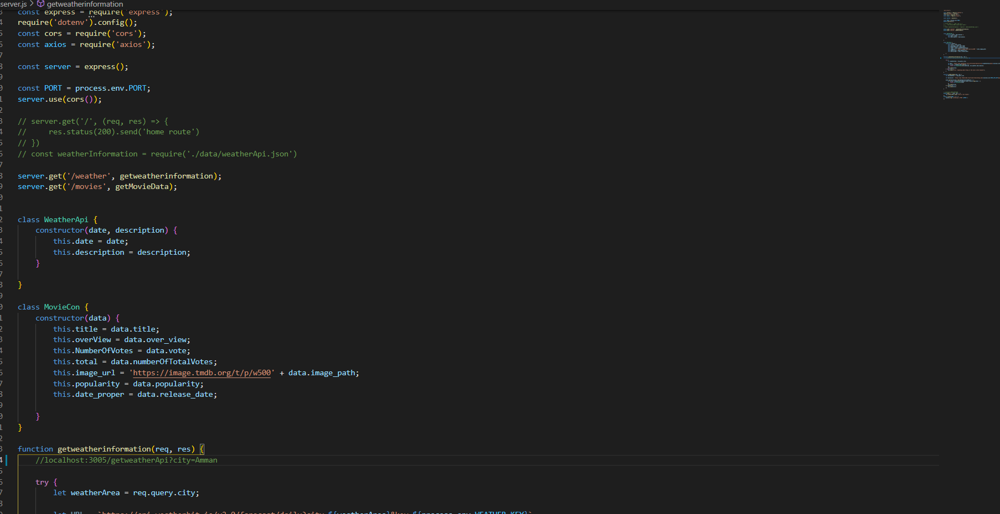
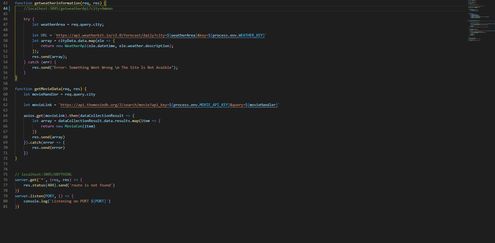
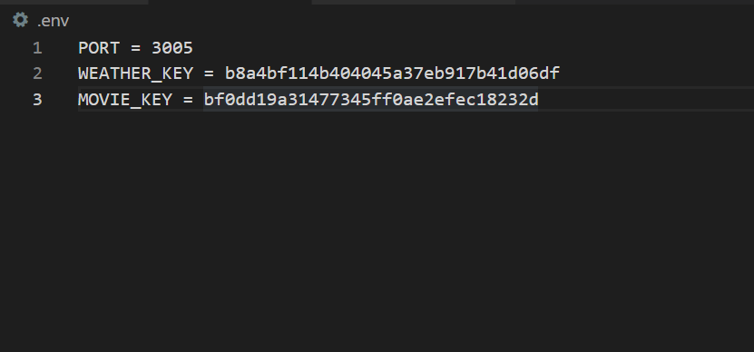
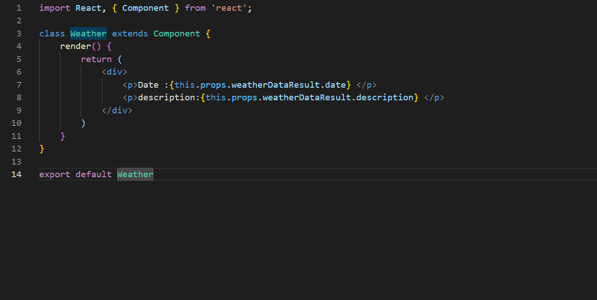
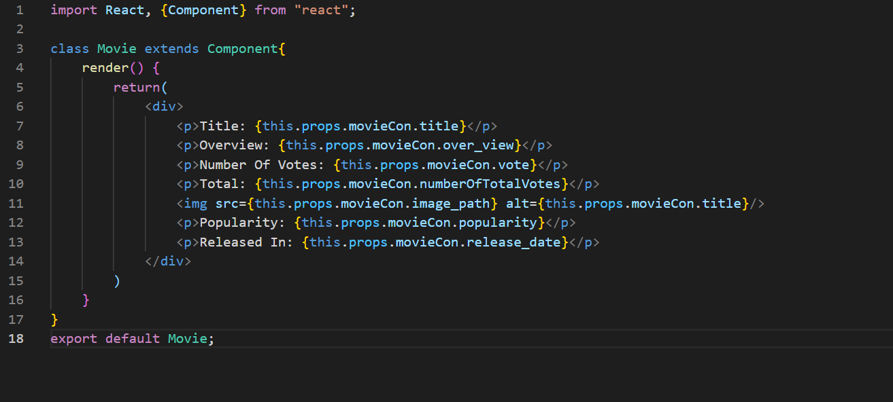
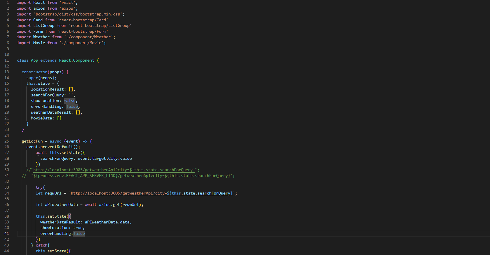
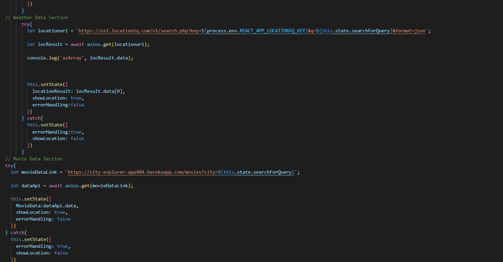
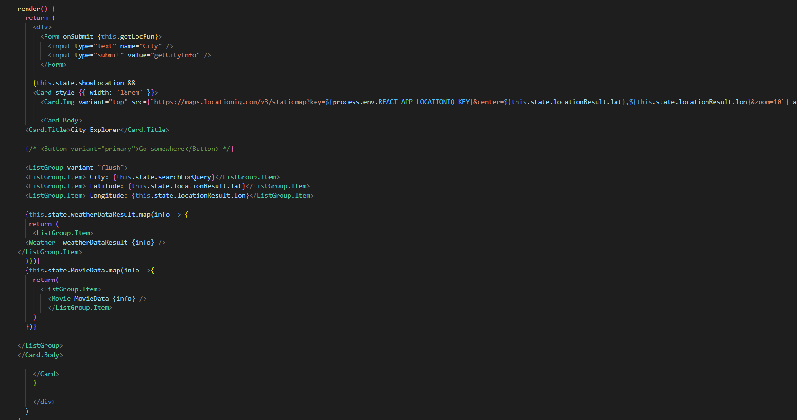

## Back-End Section

into my code there are many important functions that play a big role into our API, so let's take a look into my code:

This section is responsible for declaring the back-end data and define all the server constants, as we see that there are many seperate declarations and each one represent a specific sections for example i declared the weather class to be responsible for providing the API with the needed arguments, and there is another class that holds the Movie API and by taking a look into it we will find the constructor that holds the API vlaues.

This section shows us the operations that responsible for taking the local request and show the data and handling the errors if there is any missing or conflict.

This section contains all the required keys for the API

## Front-End section

In order to get all the results for the all the data that i have worked on before, and make it appears in a suitable form, i have made the front-end section that holds the API proertyies.

I will start with the components, and the main idea of it is to make a properties and collect the data from it seperate function to set it in the front API section

This section shows the main components and tools that we need it usage and how we import it, then we can see the main class that will collect all the operation's, functions, methodologies, etc..

Then i added the constructor which will hold all the required objects for every section.

After we declared the url's and the entry data we have to give it a ways that should handle the status of it whereever all the collected data is clear and right it will send it to the local host to show it, or it will catch the error if there are any missing.

Finally i have the render that will collect the forms, sections, lists, or the structure that will apeare to the user after filling the data that he need