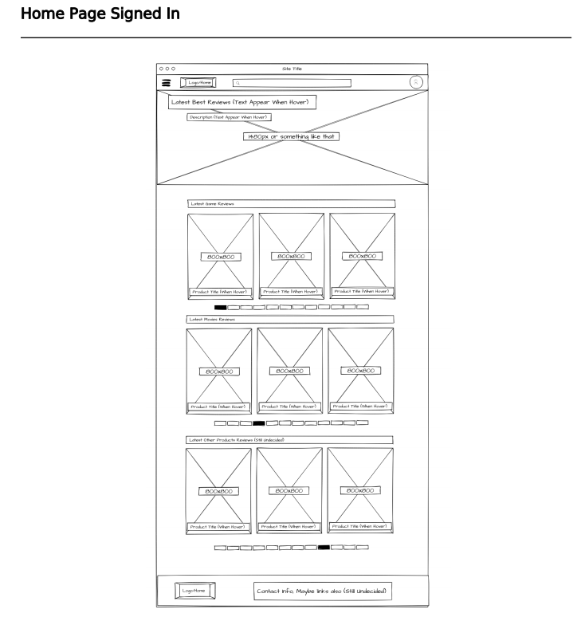
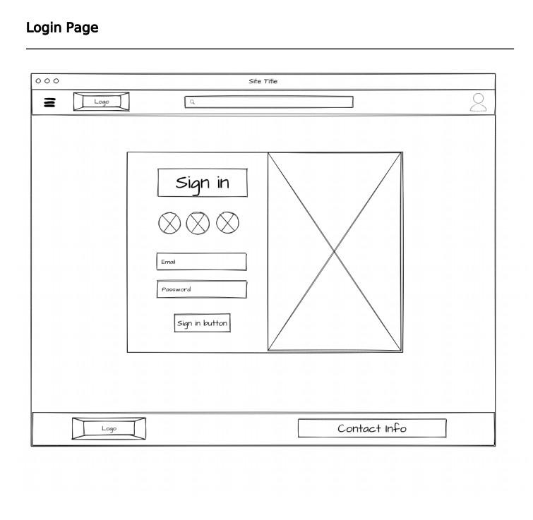
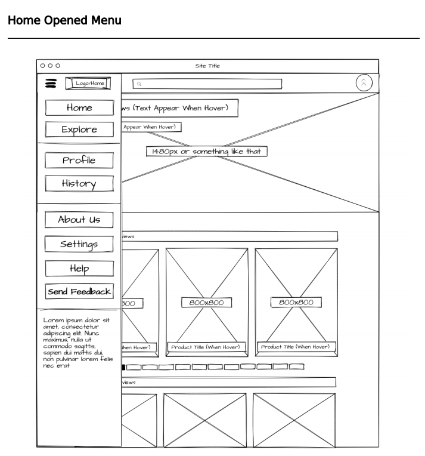
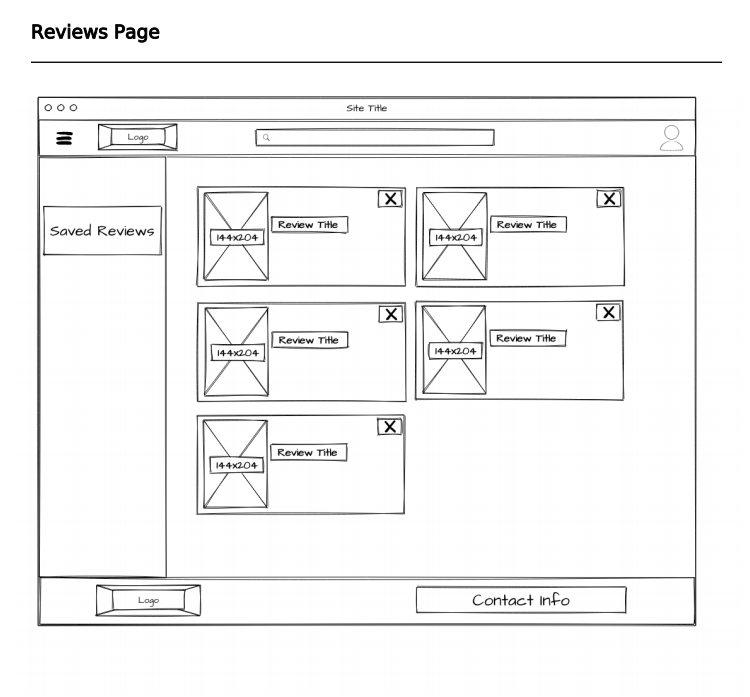
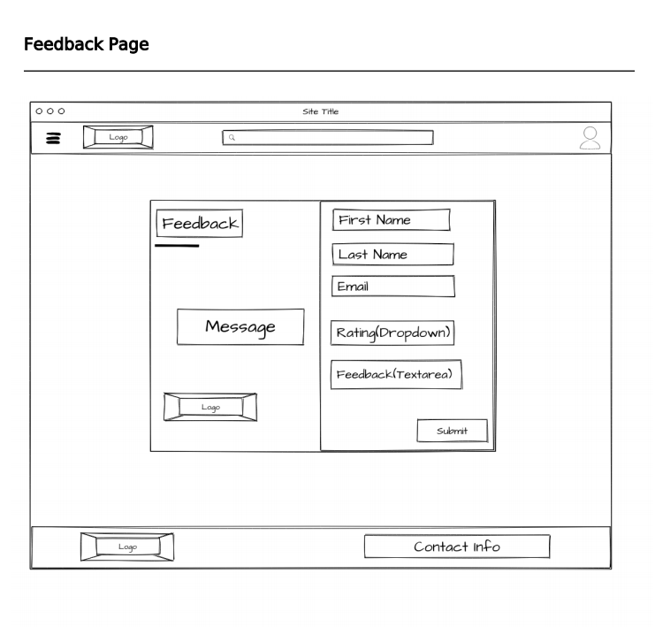
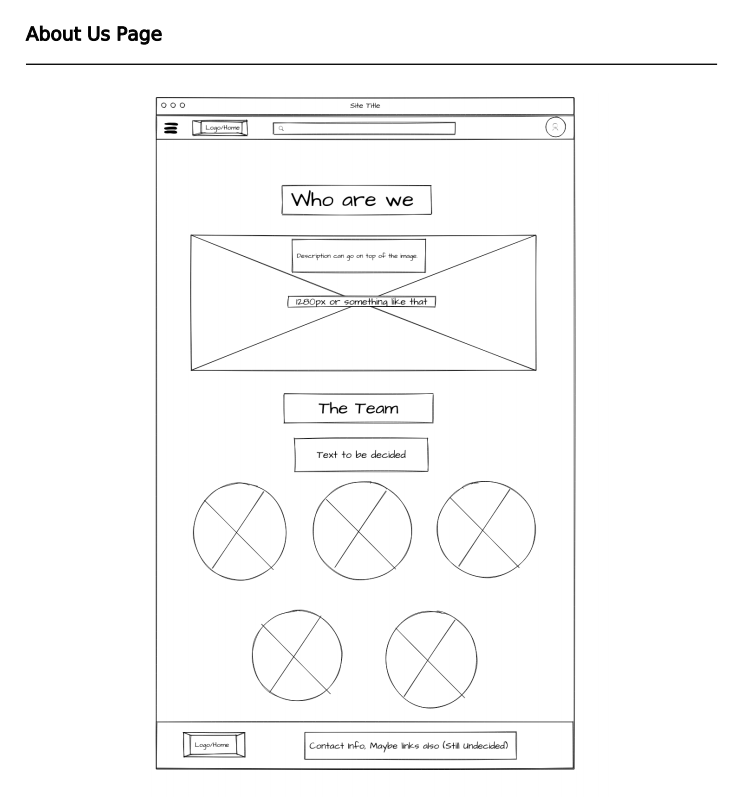
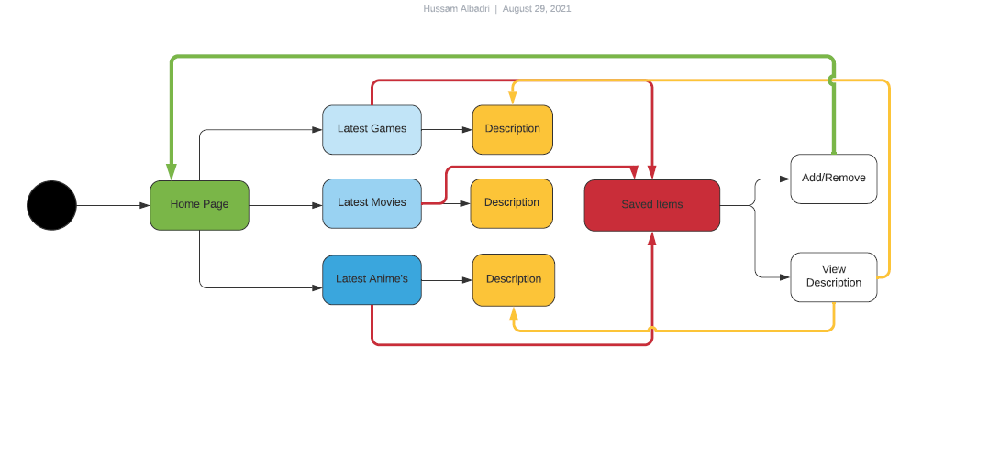

# Software Rrquirements

## Task 1

### The Problem Domain

There are many people facing a problems while they want to buy a game of a movie  to check it worth to buy or not, So the purpose of our website is to make these matters easier for them by displaying the reviews of people who have already tried the product and want to share their experience with others, while also assisting them in deciding whether it is worth  or not; in other words, we will save them money and time.

### Requirements

Our website contain 5 pages, each page have a specific functionality.

- **The Home Page**: This page contain all the showed data and most of functions.
- **The LogIn-SignIn Page**: This page will lead the user to put his personal data to save all his operation's and movements inside the website.
- **The Saved Items Page**: While the user is exploring our website sections and he is interested in something he can save it to check it back later, and all these saved items will be stored into the saved items section.
- **The FeedBack Page**: In order to stay in line with our users, we created this page to check if the user satisfied into our services or there is any suggestions for improvements.
- **About Us Page**: This section have an informations about the development team.

## Task 1.2

- The code conflicts and the time that we took to solve these conflicts.
- The Network Connection, The caused a delay to upload the files and to merge the files.
- Tension and conflict: Conflict or a difference of opinion can be good and, when handled properly, can lead to productive dialogues. It has the potential to cause people to think in new ways, broadening their knowledge and understanding; innovation can occur, and results can grow. It is not a terrible thing to have different points of view. What makes a difference is how we deal with disagreement.

### The wireframe

### The Local Storage

Local Storage is a feature that allows JavaScript sites and apps to save key-value pairs in a web browser without having to worry about them expiring. This means that the data stored in the browser will survive the closing of the browser window.
Into our demo we used the local storage to store the chosen item from the home page to put it into a specific section to check it later.

### Agile Diagram

 
The meaning of Agile is swift or versatile. “Agile method model" refers to a software system development approach supported iterative development. Agile methods break tasks into smaller iterations, or elements don't directly involve long run planning. The project scope and requirements are arranged down at the start of the development method. Plans relating to the number of iterations, the length and the scope of every iteration are clearly defined in advance.

Each iteration is considered as a brief time "frame" within the Agile method model, which generally lasts from one to four weeks. The division of the complete project into smaller elements helps to attenuate the project risk and to reduce the project delivery time requirements. each iteration involves a team operating through a full software system development life cycle including planning, requirements analysis, design, coding, and testing before a operating product is incontestable to the client.
Now let’s check the phases of this model….

•	Requirement gathering  
In this section, you must define the requirements. you should make a case for business opportunities and set up the time and effort required to make the project. supported this information, you'll valuate technical and economic feasibility. 

•	Design the requirements 
When you have known the project, work with stakeholders to define requirements. you'll use the user flow chart or the high-level UML diagram to point out the work of recent options and show how it will apply to your existing system.
•	Construction (Iteration) 

When the team defines the requirements, the work begins. Designers and developers begin working on their project, that aims to deploy a operating product. the product can bear varied stages of improvement thus, it includes simple, lowest practicality.

•	Testing
In this section, the standard Assurance team examines the product's performance and looks for the bug.

•	Deployment 
In this section, the team problems a product for the user's work environment.

•	Feedback 
After releasing the product, the last step is feedback. In this, the team receives feedback regarding the product and works through the feedback.
Agile testing methods 

•Scrum 

•Crystal 

•Dynamic software development method (DSDM)

•Feature driven development (FDD)

•Lean software development 

•Extreme programming (XP)

Advantages and disadvantages 

**Advantages** 

•Frequent Delivery

•Face-to-Face Communication with clients

• Efficient style and fulfils the business requirement

•Anytime changes are acceptable

•It reduces total development time

**Disadvantages**

•Due to the shortage of formal documents, it creates confusion and crucial 
choices taken throughout numerous phases are often misinterpreted at any time by completely different team members.

•Due to the lack of correct documentation, once the project completes and also the developers assigned to a different project, maintenance of the finished project will become an issue.

When do we use this model?

•When frequent changes are needed.

•When an extremely qualified and experienced team is available.

•When a client is prepared to own a gathering with a software team all the time.

•When project size is little.

