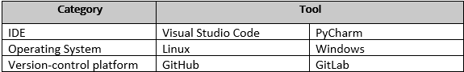

# Task 2

 In this section i will talk about some software tools that we use into our projects,but before this let's make some comparisons between the mentioned tools:

 

 So, let's start:

 ## The IDE's

 Visual Studio Code | PyCharm
 -------------|-------------

 ### Pycharm

 It is one of the most popular IDEs for Python development. PyCharm was designed specifically for Python.
All of the extensions and plugins are geared toward making the Python development process easier.
PyCharm comes with a number of built-in python databases and libraries, including MySQL and Oracle.
It has room for a graphical debugger, code analysis, integration, Django web development, integrated unit testing, and version control system integration.
PyCharm works on all platforms, including macOS, Linux, and Windows.

### Visual Studio Code

VSCode is a source code editor, however its integrated development environment (IDE) and text editing features are limited. It works with a variety of programming languages, including Java, Go, JavaScript, and C++.

VSCode is built on the Electron framework, which is used to create Node.js programs using the Blink layout engine.

It does not use the project system, but it does allow users to have many directories that can be saved and reused. Users can exclude undesirable files from a project in VS =Code's settings.

**Why do I choose VS Code insted of Pycharm?**

Vs code is an open-sourse platform, the API and the developing tools inside this platform is so helpful, and more userfriendly.

-----------------------

## Operating Systems

 Linux | Windows
 -------------|-------------

Windows is a collection of operating systems, sometimes known as a computer operating system (OS), created by Microsoft for use on personal computers and other devices (PC). Each operating system includes a desktop with a graphical user interface (GUI) that allows users to see all files, movies, and other media. It's made to run on x86 hardware, which includes AMD and Intel processors. As a result, practically every manufacturer that makes PCs or laptops ships with Windows OS. Linux is a UNIX-based open-source operating system that was first released in 1991. It's a type of program that sits on top of all other software on a computer. Because it is an open-source operating system, users can edit the existing code and make distributions from it.

**What type of OS do i use?**

I used to use windows for a years. but, if we want to talk about the flexibility (Linux) is the better choice.

---------------------
## Version-Control Platform 

GitHub | GitLab
 -------------|-------------

### GitHub

GitHub is a repository hosting platform that combines all of a developer's issue tracking and code management needs into one easy-to-use free package. GitHub is so well-known that it's nearly synonymous with Git.

GitHub hosts the vast majority of open-source code repositories. This is unsurprising given that it was the sole platform of its kind at the time of its creation. There aren't many free options that offer the same powerful core functionality.

In 2018, Microsoft purchased GitHub, which resulted in a number of changes. Free private repositories with no limits and CI/CD integration were the most crucial of them. GitHub recently provided CI/CD connections in late 2019, however you've been able to utilize Jenkins with your GitHub projects for a long time.

### GitLab

Unlike GitHub, GitLab was designed to be a testing platform rather than a repository hosting service. Dmitriy Zaporozhets began the project as an open-source project because he felt there was a need for a good collaborative tool. GitLab has always been a collaboration tool first and a repository second, with CI/CD at its foundation.

As GitLab grew in popularity, the core product remained open source, dividing into two code bases. Individuals and open source initiatives were targeted for the community edition. And there was the Enterprise Edition, which was designed to give businesses the capabilities they required.

**What type of Version-Control Platform  do i use?**

Github, because most of my work depend on storing the data or the projects that i made into a platform that hosts these repostories not a testing platform.

